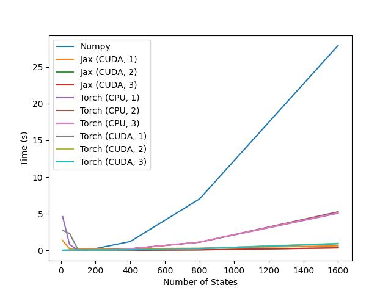

# JAX Playground
This repository is a work-in-progress and serves to test out JAX as a acceleration/ DL framework.

## Hardware for Speedtests
Speedtests are conducted on a Ubuntu system with a Intel® Core™ i7-10750H CPU @ 2.60GHz, 16GB of RAM, and a GTX 1650Ti GPU (4GB VRAM).

## Value Iteration

")
